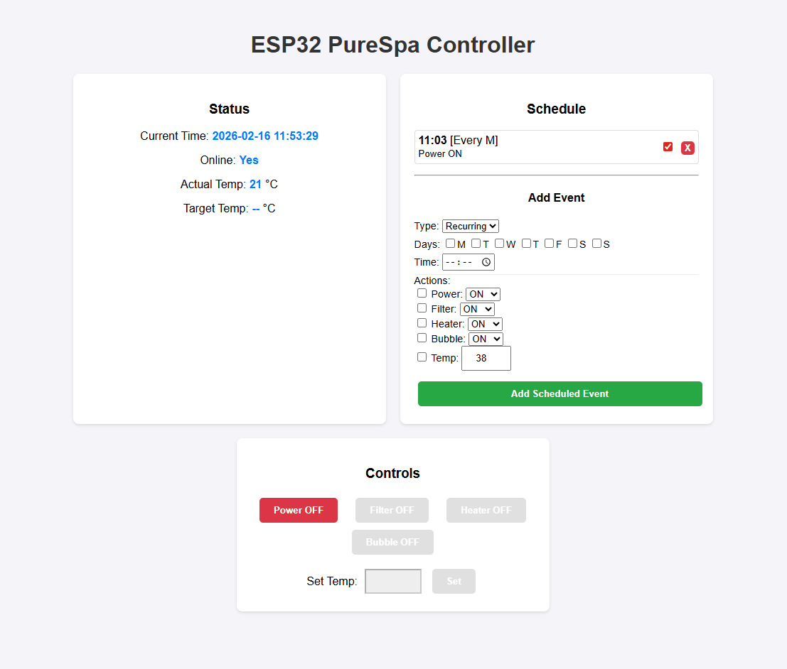
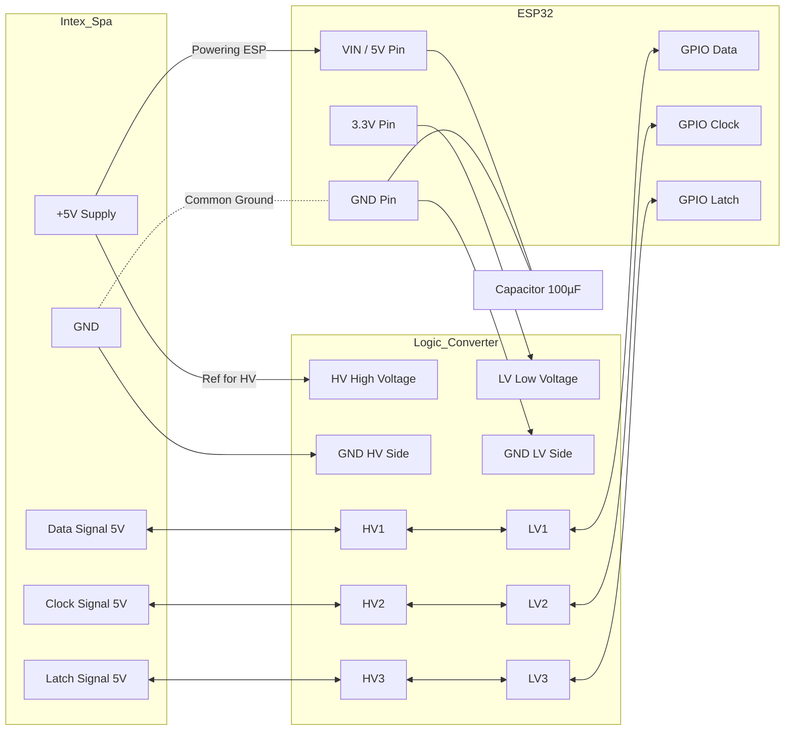

# ESP32 PureSpa Controller

This project is a port of the [esp8266-intexsbh20](https://github.com/jnsbyr/esp8266-intexsbh20) project to the **ESP32** platform.

**The primary goal** is to upgrade standard Intex PureSpa whirlpools with modern **Smart Home capabilities**. By integrating an ESP32, you gain **full remote control** over WiFi and **custom scheduling** features that are missing from the original control panel. This allows you to:
- Heat the water during off-peak hours to save energy.
- Ensure filtration cycles run automatically even if you are away.
- Turn on the bubbles from your phone before you step outside.

**⚠️ WARNING: USE AT YOUR OWN RISK. Opening your spa controller and connecting custom electronics voids your warranty and involves mains voltage risks.**

## Table of Contents
- [Compatibility](#compatibility)
- [New Features](#new-features-esp32)
- [Technical Implementation](#technical-implementation)
- [Real-time Status](#real-time-status)
- [Installation](#installation)
- [Disclaimer](#disclaimer)

## Compatibility

This project supports the same models as the original ESP8266 version:
- Intex PureSpa SB-H20
- Intex SimpleSpa SB–B20
- Intex PureSpa SSP-H-20-1
- Intex PureSpa SJB-HS

## New Features (ESP32)

Unlike the original MQTT-centric firmware, this ESP32 port focuses on a standalone Web UI experience, while maintaining the core logic for communicating with the spa controller.

### 1. Web User Interface
A hosted web server provides a dashboard to:
- Monitor status (Temperature, Power, Filter, Heater, Bubbles).
- Control all functions remotely.
- View connection status and debug info.

### 2. Built-in Scheduling
The ESP32 stores a schedule in its non-volatile memory (NVS), allowing automation without an external hub:
- **Recurring Events:** Schedule actions for specific days of the week (e.g., "Every Mon, Wed at 18:00").
- **One-time Events:** Schedule a specific date and time.
- **Actions:** Turn Power, Filter, Heater, or Bubbles ON/OFF, and set target Temperature.
- **Auto-Power On:** If a scheduled event requires a feature (e.g., Heater ON) and the Spa is OFF, it will automatically power ON the Spa first.

### 3. WiFi Access Point & Manager
- **Access Point Mode:** If no known WiFi is found, the device creates an Access Point named `ESP32-PureSpa-Config`.
- **Captive Portal:** Connect to the AP to configure your home WiFi credentials via a simple web page.

### 4. Missing Features
- **MQTT:** Support for MQTT has **not** been implemented yet in this port.

## Hardware

This project simplifies the original hardware design by leveraging readily available modules.

### Components Used:
- **ESP32-WROOM-32:** A standard ESP32 development board.
- **Bi-Directional Logic Level Converter (TTL):** Instead of building a voltage divider with resistors, I used a pre-made module to safely interface the Spa's 5V logic with the ESP32's 3.3V logic.
- **Capacitor (optional but recommended):** A small electrolytic capacitor (e.g., 100µF or 470µF) between the +5V and GND lines near the ESP32 can help stabilize the power supply if powering directly from the Spa.

### Power Options
1. **Direct Power (Recommended for clean setup):** Connect the Spa's +5V line to the **VIN / 5V** pin of the ESP32 board. This powers the ESP32 directly from the Spa.
2. **External USB:** You can also power the ESP32 via its micro-USB/USB-C port using a separate phone charger or power bank if you prefer not to tap the Spa's power line for the heavy load.

### Wiring Diagram

### Connectors & Plug
To connect to the Intex control panel without cutting wires, you can 3D print the connectors. I successfully used the models from the original project:

- [Intex PureSpa connectors (Thingiverse)](https://www.thingiverse.com/thing:4130911)
- [Case incl. Intex PureSpa connectors (Printables)](https://www.printables.com/en/model/509289-intex-purespa-whirlpool-controller-electromechanic)

## Technical Implementation

### Multicore Architecture
The ESP32's dual-core architecture is utilized to improve stability compared to the ESP8266 version:
- **Core 0 / WiFi:** Handles the network stack, Web Server, and background tasks.
- **Core 1 / PureSpaIO:** The specific protocol to read/write signals to the Spa controller runs on a dedicated FreeRTOS task pinned to a separate core.

**Improvement:** unlike the ESP8266 version, **we do not need to disable WiFi** to reliably send button signals or decode the display frames. The separation of concerns allows the IO protocol to run with high priority without being interrupted by network traffic.

**Challenges:** Despite the dual-core setup, achieving perfect timing was challenging. There are occasional synchronization issues or race conditions between variables shared across cores, which can make the timing strict. However, the current implementation is stable for daily use.

## Real-time Status

### Polling Method
The Web UI currently uses **HTTP Polling** (fetching status every 2 seconds) to update the dashboard. 

### Why not Server-Sent Events (SSE)?
SSE was implemented and tested but ultimately abandoned. The ESP32's HTTP server implementation (esp_http_server) is single-threaded by default. An open SSE connection would lock the server, preventing other requests (like button clicks or API calls) from being processed until the connection timed out.

### Future: WebSockets
The ideal solution for real-time, bi-directional communication without the blocking issues of SSE or the overhead of polling is **WebSockets**. This is planned for a future update.

## Future Improvements

### ESPHome Component
The current codebase is a standalone C++ project. A great future addition would be to wrap the `PureSpaIO` logic into a custom **ESPHome component**. This would allow users to:
- Easily integrate with **Home Assistant** without writing any C++ code.
- Benefit from ESPHome's native OTA, API, and WiFi management.
- Define automations directly in YAML.

### MQTT Support
While the original project was MQTT-centric, this port currently lacks it. Re-implementing MQTT would allow for universal integration with any home automation hub (OpenHAB, Domoticz, etc.).

### Power Saving (Deep Sleep)
Currently, the ESP32 runs continuously. A future update could implement **Deep Sleep** capabilities to save power when the Spa is idle (Power OFF) for several minutes.

The ESP32 could automatically wake up based on:
1.  **Scheduled Events:** Using the RTC timer to wake up exactly when a scheduled task needs to execute.
2.  **External Wake-up:** Potentially waking up on incoming network activity (though this requires Light Sleep rather than Deep Sleep to maintain WiFi association) or periodic checks.

## Credits

This project is heavily based on the work of:
- [Jens B. (jnsbyr)](https://github.com/jnsbyr/esp8266-intexsbh20) - Original ESP8266 reverse engineering and firmware.
- [Geoffroy Hubert (diyscip)](https://github.com/yorffoeg/diyscip) - Initial reverse engineering of the protocol.
- [Elektroarzt](https://github.com/Elektroarzt) - PCB Designs.

## Disclaimer

This is a hobby project. **There is no warranty.** You are responsible for any damage to your hardware or yourself. Working with electricity and water requires extreme caution.
